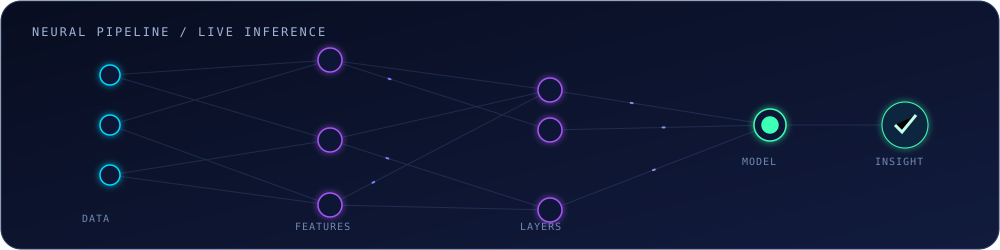

## About me

 &nbsp; **Human signal detected**

### Hi, I'm Leonardo Sullón 

I am a **Software Engineering student** passionate about **Data Science, Artificial Intelligence, and software development**. I enjoy building innovative solutions that combine technology, creativity, and real-world impact. Currently, I am expanding my knowledge in Artificial Intelligence, Machine Learning, Python, and Swift development, while continuously exploring new tools and technologies that help me grow as a developer.

#### Currently learning

- Artificial Intelligence & Machine Learning
- Python for Data Science
- Swift Development
- Data Analytics

💡 I enjoy turning ideas into projects, solving problems, and constantly challenging myself to learn something new. I believe that learning never stops, and I am always looking for opportunities to improve my skills and broaden my knowledge.

Outside of tech, 🎮 I enjoy playing video games, 🎵 listening to music—especially electronic music—and 📺 watching anime, with **One Piece** being one of my favorites.

> 🚀 Always learning, always building, and always looking for the next challenge.

 

## Identity synthesis

## Skills

### Languages

### Machine Learning / Data Science

### Databases

### Hosting / SaaS

### IDEs / Editors

### Other Tools & Technologies

 

## GitHub analytics

 

### Contribution snake

<picture>
  <source media="(prefers-color-scheme: dark)" srcset="./assets/generated/github-contribution-grid-snake-dark.svg" />
  <source media="(prefers-color-scheme: light)" srcset="./assets/generated/github-contribution-grid-snake.svg" />
  
</picture>

